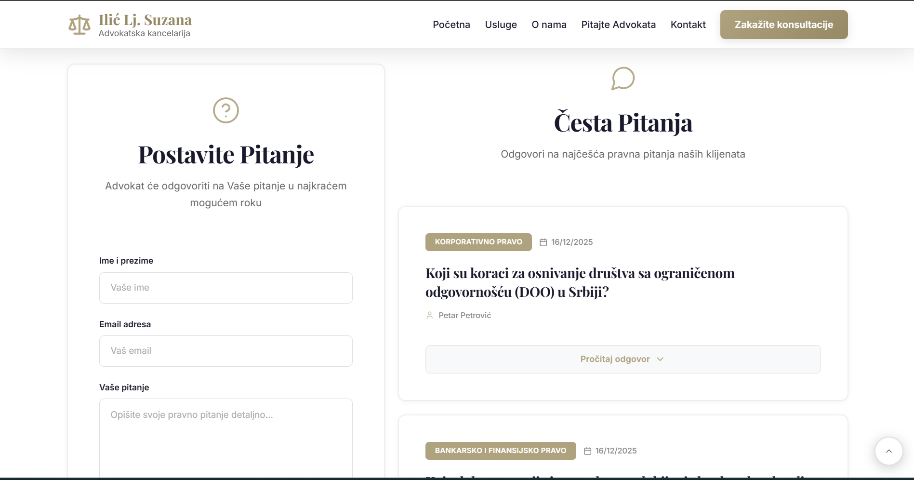
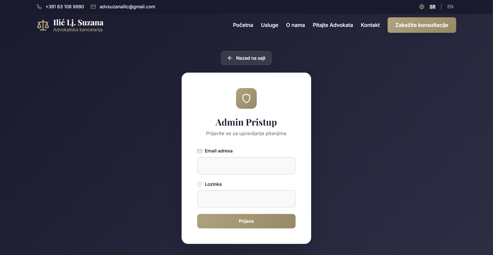
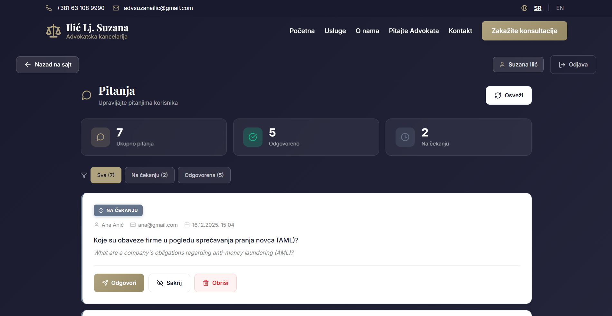

<div align="center">

# ⚖️ Advokatska Kancelarija Ilić Lj. Suzana

### Professional Legal Services Website

[](https://reactjs.org/)
[](https://getbootstrap.com/)
[](https://nodejs.org/)
[](https://www.mongodb.com/atlas)
[](LICENSE)

A modern, bilingual (Serbian/English) website for **Advokatska Kancelarija Ilić Lj. Suzana** — a distinguished Serbian law firm with over 30 years of expertise in corporate law, banking and financial law, compliance, and anti-money laundering services.

[**🌐 View Live Site**](https://advokatska-kancelarija.onrender.com/) 
</div>

---

## 📸 Screenshots

<div align="center">

| Homepage | Q&A Section |
|:--------:|:-----------:|
|  |  |

| Admin Dashboard | Admin Portal |
|:---------------:|:------------:|
|  |  |

</div>

---

## 📋 Table of Contents

- [About the Project](#-about-the-project)
- [Features](#-features)
- [Technology Stack](#-technology-stack)
- [Getting Started](#-getting-started)
- [Project Structure](#-project-structure)
- [Admin Panel](#-admin-panel)
- [Deployment](#-deployment)
- [Contributing](#-contributing)
- [License](#-license)
- [Contact](#-contact-information)

---

## 🏛️ About the Project

This modern React application serves as the digital presence for attorney **Suzana Ilić**, who brings over **30 years of distinguished experience** in the Serbian banking sector, including serving as **Director of Compliance at AIK banka a.d. Niš**.

The website embodies professional excellence through:

- **Conservative, trustworthy design** appropriate for legal services
- **Comprehensive service information** across 12 practice areas
- **Seamless bilingual experience** for local and international clients
- **Mobile-first responsive architecture** ensuring accessibility across all devices

> *"Building trust through professionalism and expertise"*

---

## ✨ Features

### 🌍 Bilingual Support
Complete Serbian and English language support with seamless, context-preserving language switching throughout the entire application.

### 📱 Responsive Design
Meticulously optimized for all screen sizes:
- **Mobile:** 320px - 576px
- **Tablet:** 577px - 992px
- **Desktop:** 993px - 1400px
- **Large displays:** 1401px+

### 💼 Professional Aesthetics
Conservative, authoritative design language that builds credibility and trust — essential for legal service marketing.

### 📬 Contact Integration
Direct client communication powered by **EmailJS** with form validation and confirmation feedback.

### ❓ Interactive Q&A System
- Public question submission
- Administrative review and response
- Bilingual answer support
- Archive management

### 📄 Individual Service Pages
Detailed information pages for each of the **12 practice areas** with comprehensive legal service descriptions.

### 🔒 Secure Admin Panel
JWT-authenticated administrative dashboard for content management and client communication oversight.

---

## 🛠️ Technology Stack

<table>
<tr>
<td valign="top" width="50%">

### Frontend
| Technology | Purpose |
|------------|---------|
|  | Component architecture |
|  | Client-side routing |
|  | Responsive grid & utilities |
|  | Build tooling & HMR |
|  | Iconography |

</td>
<td valign="top" width="50%">

### Backend
| Technology | Purpose |
|------------|---------|
|  | Runtime environment |
|  | API framework |
|  | Cloud database |
|  | Authentication |

</td>
</tr>
</table>

### Additional Services
- **EmailJS** — Contact form handling
- **Google Fonts** — Inter typography family
- **Render** — Cloud deployment platform

---

## 🚀 Getting Started

### Prerequisites

Ensure you have the following installed:

```bash
node --version  # v18.x or higher
npm --version   # v9.x or higher
```

### Installation

1. **Clone the repository**
   ```bash
   git clone https://github.com/anicabarrios/consultation.git
   cd consultation
   ```

2. **Install frontend dependencies**
   ```bash
   npm install
   ```

3. **Configure environment variables**
   ```bash
   cp .env.example .env
   ```
   
   Add your EmailJS credentials to `.env`:
   ```env
   VITE_EMAILJS_SERVICE_ID=your_service_id
   VITE_EMAILJS_TEMPLATE_ID=your_template_id
   VITE_EMAILJS_PUBLIC_KEY=your_public_key
   ```

4. **Start development server**
   ```bash
   npm run dev
   ```
   
   The app will be available at `http://localhost:5173`

### Backend Setup

```bash
# Navigate to backend directory
cd backend

# Install dependencies
npm install

# Configure environment
cp .env.example .env
```

Add the following to your backend `.env`:
```env
MONGODB_URI=your_mongodb_atlas_connection_string
JWT_SECRET=your_secure_jwt_secret
PORT=5000
```

Start the backend server:
```bash
npm start
```

### Production Build

```bash
# Create optimized production build
npm run build

# Preview production build locally
npm run preview
```

---

## 📁 Project Structure

```
consultation/
├── 📂 public/
│   └── 📂 images/           # Static assets & screenshots
├── 📂 src/
│   ├── 📂 components/       # Reusable UI components
│   │   ├── Header.jsx
│   │   ├── Footer.jsx
│   │   ├── Hero.jsx
│   │   ├── About.jsx
│   │   ├── Services.jsx
│   │   ├── Contact.jsx
│   │   ├── Reviews.jsx
│   │   └── ...
│   ├── 📂 pages/            # Route-level page components
│   │   ├── HomePage.jsx
│   │   ├── AboutPage.jsx
│   │   ├── ServicesPage.jsx
│   │   ├── ServicePage.jsx
│   │   ├── ContactPage.jsx
│   │   ├── QAPage.jsx
│   │   └── AdminPage.jsx
│   ├── 📂 utils/            # Helper functions & data
│   │   ├── colors.js        # Centralized color system
│   │   └── serviceData.js   # Service content (SR/EN)
│   ├── 📂 api/              # API integration
│   │   └── Qaapi.js
│   ├── App.jsx              # Root component & routing
│   ├── App.css              # Global styles
│   ├── index.css            # Base styles & resets
│   └── main.jsx             # Application entry point
├── 📂 backend/
│   ├── 📂 controllers/      # Route handlers
│   ├── 📂 models/           # MongoDB schemas
│   ├── 📂 routes/           # API endpoints
│   └── index.js             # Server entry point
├── vite.config.js           # Vite configuration
├── package.json
└── README.md
```

---


## 🔐 Admin Panel

The protected administrative dashboard provides comprehensive content management:

| Feature | Description |
|---------|-------------|
| **🔑 Secure Authentication** | JWT-based login with session management |
| **📥 Question Management** | View, filter, and manage client submissions |
| **✍️ Bilingual Responses** | Add answers in both Serbian and English |
| **✅ Approval Workflow** | Review and approve Q&A content for publication |
| **🗄️ Archive System** | Organize and archive resolved questions |
| **📊 Dashboard Overview** | Quick stats and recent activity |

### Admin Access

```
Route: /admin
Authentication: JWT Bearer Token
Session Duration: 24 hours
```

---

## 🌐 Deployment

The application is deployed on **Render** with automated CI/CD:

### Frontend Deployment
- **Type:** Static Site
- **Build Command:** `npm run build`
- **Publish Directory:** `dist`
- **Auto-Deploy:** On push to `main` branch

### Backend Deployment
- **Type:** Web Service
- **Build Command:** `npm install`
- **Start Command:** `npm start`
- **Health Check:** `/api/health`


---

## 🤝 Contributing

Contributions are welcome! Please follow these steps:

1. **Fork the repository**
2. **Create a feature branch**
   ```bash
   git checkout -b feature/AmazingFeature
   ```
3. **Commit your changes**
   ```bash
   git commit -m 'Add some AmazingFeature'
   ```
4. **Push to the branch**
   ```bash
   git push origin feature/AmazingFeature
   ```
5. **Open a Pull Request**

### Code Style Guidelines
- Follow React best practices and hooks conventions
- Maintain consistent component structure
- Ensure responsive design compatibility
- Provide bilingual content for user-facing text

---

## 📄 License

Distributed under the **MIT License**. See `LICENSE` for more information.

---

## 📞 Contact Information
### Developer

**Anica Barrios**  
📧 [anicabarrios1@gmail.com](mailto:anicabarrios1@gmail.com)  
💼 [GitHub](https://github.com/anicabarrios)

</div>

---

<div align="center">

**Built with ❤️ for professional legal services**

[](https://reactjs.org/)

</div>
